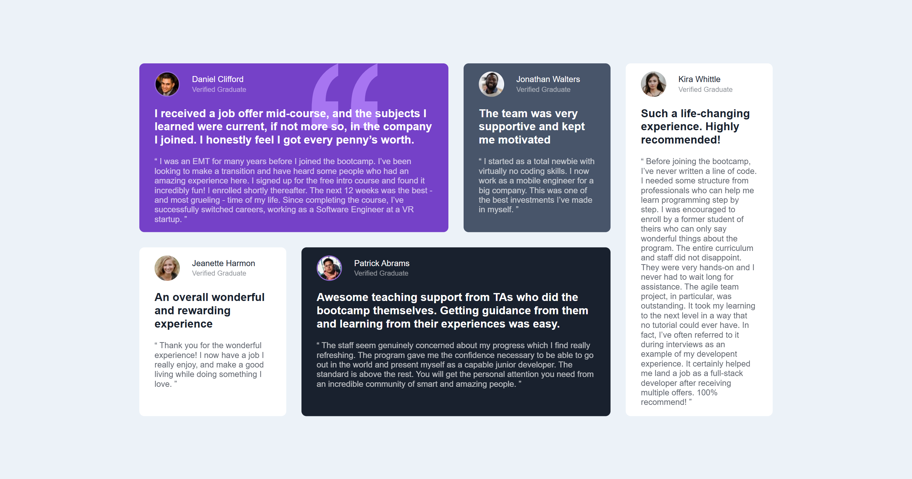
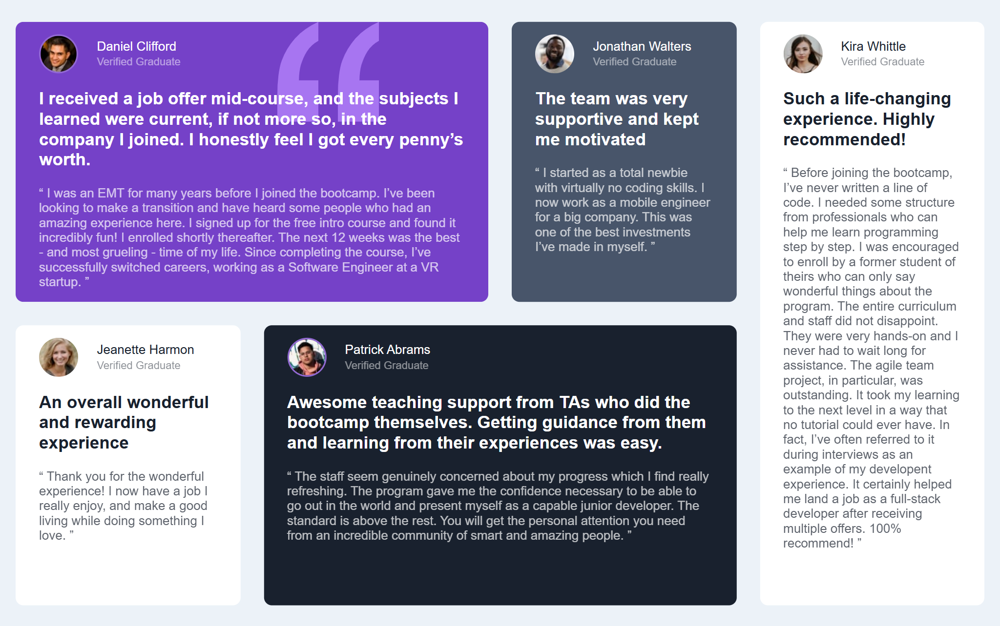

# Frontend Mentor - Testimonials grid section solution

This is a solution to the [Testimonials grid section challenge on Frontend Mentor](https://www.frontendmentor.io/challenges/testimonials-grid-section-Nnw6J7Un7).

## Table of contents

- [Overview](#overview)
  - [The challenge](#the-challenge)
  - [Screenshot](#screenshot)
  - [Links](#links)
- [My process](#my-process)
  - [Built with](#built-with)

## Overview

### The challenge

Users should be able to:

- View the optimal layout for the site depending on their device's screen size

### Screenshot

#### 1440px Desktop

#### 1024px Desktop

#### 768px Tablet

#### 320px Mobile

### Links

- Solution URL: [GitHub Repo](https://github.com/webwalacoder/fem-testimonial-grid-section-challenge)
- Live Site URL: [Live Preview](https://webwalacoder.github.io/fem-testimonial-grid-section-challenge/)

## My process

### Built with

- Semantic HTML5 markup
- CSS custom properties
- Flexbox
- CSS Grid
- Mobile-first workflow
